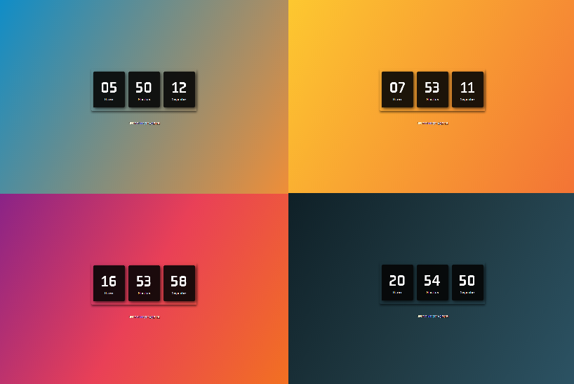

# relogio-digital

<h4 align="center"><a href="https://relogio-digital-mu.vercel.app/">Clique para visitar o projeto</a></h4>

## 🎯 Objetivo

Projeto base desenvolvido através do tutorial da [Larissa Kich](https://www.youtube.com/watch?v=GK0ok3ZCXwM&t=1s), adicionei a funcionalidade para trocar a cor do background conforme período do dia e responsividade.

## 🛠️ Tecnologias utilizadas

Para o desenvolvimento deste site utilizei as seguintes tecnologias:

- HTML;
- CSS;
- JavaScript;
